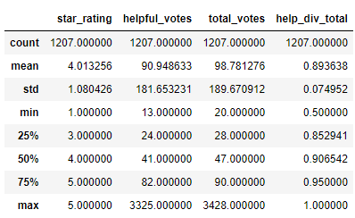

# Amazon_Vine_Analysis  
  
### Overview of the analysis:  

In this analysis Vine review data are downloaded, parsed into 4 tables, and uploaded to an AWS database linked to a local PostgreSQL database.  The goal of the analysis is to determine any bias in reviews based on the review being from a paid or unpaid account.  
  
The analysis is performed on the vine review data table in the SQL database.  The Vine review data were exported as a .csv file and loaded into a Pandas dataframe in Python.  

In Python the the data are filtered to reviews that received 20 or more votes and to reviews with at least 50% (>= 50%) of the votes being "helpful."  
  
### Results:  

1. How many Vine reviews (paid) and non-Vine (unpaid) reviews were there?    
  
There are 1,207 paid Vine reviews that meet the criteria.  
  
There are 97,839 unpaid Vine reviews that meet the criteria.  
  
  
2. How many reviews of each are 5 star?  
Unpaid:  45,858  
Paid:  509
  
3. What percentage of each are 5 star?    
42% of the paid reviews were positive.  
47% of the unpaid reviews were positive.  
  
### Summary:  
    
The relative percentages of positive reviews are similar but there is a bias toward a higher percentage of positive votes from paid Vine accounts.  
  
A test to see if the results are real or could be a result of random noise can help to better understand the results.  
  
A T test (null hypothesis that the difference in mean between the paid and unpaid reviews is only a function of random noise) has a p value of 3.2 *10**-23.  The null hypothesis is rejected.  The differences in the means of the paid and unpaid star reviews are statistically significant.    
  
Script and result for t test follow:  
    
import scipy.stats as stats  
stats.ttest_ind(vine_filtered_four_df['star_rating'],vine_filtered_three_df['star_rating'])  
Ttest_indResult(statistic=-9.927615105596226, pvalue=3.2370768982097044e-23)  
  
